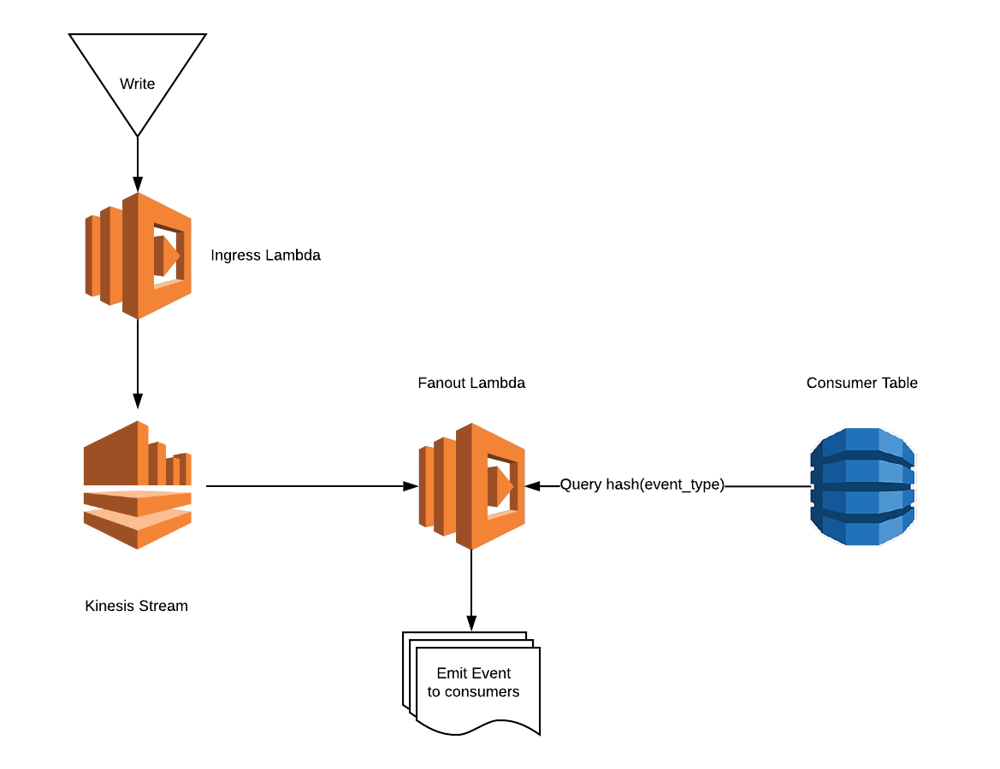

# [MVP] - Asynchronous Event Messaging System (AEMS) codename AIMS

Please note, this is a MVP for the AIMS system and everything including the name are subject to change



## Ingress
`POST - /ingress`

| name | description | type |
|--|--|--|
| type | A concatenated event type and version | string |
| payload | Useful or necessary information needed during fanout | object |


## Consumer

There are various CRUD endpoints defined in the serverless project. 

```yaml
$schema: http://json-schema.org/draft-04/schema#

title: Consumer

description: An event subscribe

type: object

properties: 
  id:
    type: uuid
    description: The unique identifier for a consumer (automatic)

  hid:
    type: string
    description: hash of the event_type (automatic)

  event_type:
    type: string
    description: event that consumer listens to

  v:
    type: semver (string)

  consumer_type: 
    type: enum
    description: the type of consumer this is

  consumer_configuration:
    type: object
    description: any data needed during the usage of the consumer

  enabled:
    type: bool
    description: whether to fanout to this consumer or not

required:
  - id
  - event_type
```